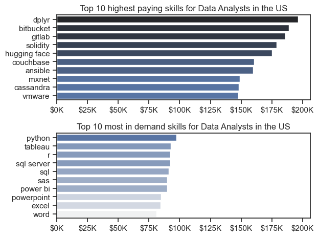

# Data-analysis-project
A data analysis project which demonstrates the application of Python in analyzing and visualizing real-world data, covering techniques such as data cleaning, transformation, and exploratory data analysis using libraries like Pandas, Matplotlib, and Seaborn.

# Analysis
## 1. What are the most demanded skills for the top 3 most popular data jobs in the United States.
To find the most demanded skills for the top 3 most popular data roles. This query highlights the most popular job titles and their top skills, showing which skills to pay more attention to depending on the role that anyone is intrested in.
View my notebook with detailed code here: [2_skill_count.ipynb](https://github.com/tilakpatel07/Data-analysis-project/blob/main/2_skill_count.ipynb).

### Visualize Data
```python

fig, ax = plt.subplots(3, 1)
fig.set_size_inches(10, 6)

for i, job_title in enumerate(job_titles):
    df_job_title = df_plot_percentage[df_plot_percentage['job_title_short'] == job_title].head(5)
    # df_job_title.plot(kind='barh', x='job_skills', y='skill_percentage', ax=ax[i], legend=False)
    sns.set_theme(style='ticks')
    sns.barplot(data=df_job_title, x='skill_percentage', y='job_skills', ax=ax[i], hue='skill_percentage', palette='dark:b_r', legend=False)
    ax[i].set_title(f'{job_title}')
    ax[i].set_ylabel('')
    ax[i].set_xlabel('')
    ax[i].set_xlim(0, 100)
    if i != 2:
        ax[i].set_xticks([])

    for idx, val in enumerate(df_job_title['skill_percentage']):
        ax[i].text(val + 1, idx, f'{val:.0f}%', va='center')
    


fig.suptitle('Likehood of a skill being required for the top 3 job titles in the United States')
fig.tight_layout()
plt.show()

```

### Results 


### Insights 
SQL Dominance Across Roles:

- SQL is the most demanded skill for all three roles, with the highest likelihood for Data Engineers (68%) and Data Analysts (51%).
  
Python’s Prominence:

- Python is a critical skill for Data Scientists (72%) and Data Engineers (65%), signifying its importance in advanced analytics and engineering roles.
  
Specialized Tools and Platforms:

- For Data Analysts, tools like Excel (41%), Tableau (28%), and SAS (19%) highlight the focus on reporting and visualization.
Data Engineers prioritize cloud platforms like AWS (43%), Azure (32%), and Spark (32%) for managing large-scale data systems.
Data Scientists value R (44%), along with Tableau and SAS (24% each), for statistical analysis and data visualization.

This analysis underlines the significance of core programming skills like Python and SQL while emphasizing the need for role-specific expertise. Aspiring professionals can tailor their skillsets based on the demand for their targeted job roles.


## 2. How are in-demand skills Trending for Data Analysts ? 

### Visualize Data
```python
sns.lineplot(data=df_plot, dashes=False, palette='tab10', legend=False)
plt.title("Trending skills for Data Analyst in the United States")
plt.xlabel('2023')
plt.ylabel('Likelihood in Job posting')
plt.ylim(0, 70)
sns.despine()

ax = plt.gca()
ax.yaxis.set_major_formatter(plt.FuncFormatter(lambda y, _: f'{int(y)}%'))

for i in range(5):
    plt.text(11.2, df_plot.iloc[-1, i], df_plot.columns[i])
plt.show()

```
### Results 


### Insights 

### Conclusion  
- **SQL**: The most essential and in-demand skill, dominating job postings.  
- **Excel**: Widely used but slightly declining, signaling a gradual shift to advanced tools.  
- **Python**: Gaining steady traction, crucial for advanced analytics and automation.  
- **Tableau**: A stable visualization tool, vital for business intelligence.  
- **Power BI**: Niche but growing in popularity, especially in certain industries.  

### Future Predictions  
- **Focus on SQL and Python**: Core skills that will remain highly valuable.  
- **Visualization Skills**: Master Tableau and Power BI for effective data storytelling.  
- **Cloud Technologies**: Learn tools like AWS Redshift and Snowflake for future-ready analytics.  
- **Real-Time Analytics**: Explore Apache Kafka for real-time data processing.  
- **Data Storytelling**: Build communication skills to present insights effectively.


## 3. Salary comparison between the top 6 data roles. 

### Visualize Data
```python
sns.boxplot(data=df_US_top6, x='salary_year_avg', y='job_title_short', order=order)
sns.set_theme(style='ticks')

plt.title('Salary distribution for the top 6 data roles')
plt.ylabel('')
plt.xlabel('Yearly salary ($USD)')
plt.xlim(0, 600000)
ax = plt.gca()
ax.xaxis.set_major_formatter(plt.FuncFormatter(lambda x, __: f'${int(x/1000)}k'))
plt.show()


```
### Results 


### Insights 

- Senior roles in data science and engineering are more lucrative and show higher earning potential, especially for individuals with specialized skills or experience.
- Roles such as Data Scientist and Data Engineer provide competitive salaries with some overlapping earning potentials, making them attractive for professionals in the field.
- The wide range of salaries and significant outliers suggest that factors like location, industry, and individual experience greatly impact salary levels.
- Entry-level roles, such as Data Analyst, have a more constrained salary range, but there is clear upward mobility in salary with seniority and experience.


## 3. Highest paid and most demanded skills for Data Analysts. 

### Visualize Data
```python

fig, ax = plt.subplots(2, 1)

sns.set_theme(style='ticks')
sns.barplot(data=df_DA_US_pay, x='median', y=df_DA_US_pay.index, ax=ax[0],hue='median', palette='dark:b_r', legend=False)
ax[0].set_title('Top 10 highest paying skills for Data Analysts in the US')
ax[0].set_xlabel('')
ax[0].set_ylabel('')

sns.barplot(data=df_DA_US_count, x='median', y=df_DA_US_count.index, ax=ax[1], hue='median', palette='light:b', legend=False)
ax[1].set_title('Top 10 most in demand skills for Data Analysts in the US')
ax[1].set_xlabel('')
ax[1].set_ylabel('')

ax[0].xaxis.set_major_formatter(plt.FuncFormatter(lambda x, _: f'${int(x/1000)}K'))
ax[1].xaxis.set_major_formatter(plt.FuncFormatter(lambda x, _: f'${int(x/1000)}K'))
ax[1].set_xlim(ax[0].get_xlim())
fig.tight_layout()

```
### Results 



### Insights 

- Technical Proficiency is Key: The graph strongly emphasizes the importance of technical skills in the data analyst field. Both the highest-paying and most in-demand skills are heavily technical, requiring knowledge of programming languages (Python, R, SQL), data management tools (dplyr, SQL Server), and visualization tools (Tableau).
- Cloud Computing is Valuable: Skills related to cloud infrastructure and development, such as those associated with Bitbucket and GitLab, are highly valued and well-compensated.
- Emerging Technologies are in Demand: Blockchain-related skills, like Solidity, are in high demand and offer significant earning potential, indicating the growing importance of this field in the data analysis landscape.
